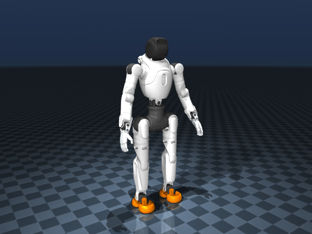

# FF Master / AgiBot X2 本地 MuJoCo 模拟器

这是从 `Faraday-Future-AI/Robothon-starter` 的 `assets/Master` 拉取并本地化的 X2 Ultra MuJoCo 模型。项目保留了上游原始 MJCF、URDF 和 STL 网格，并提供按智元 AimDK X2 官方关节范围校正的可运行版本。



## 快速启动

在 PowerShell 中进入本目录：

```powershell
cd C:\Users\xinga\Documents\Codex\2026-07-15\files-mentioned-by-the-user-aegis\outputs\Master_MuJoCo
python -m pip install -r requirements.txt
python validate_model.py
python run_simulator.py
```

本机已经检测到可用的 MuJoCo 3.10.0 和 NumPy 2.1.3，因此当前环境不需要重复安装。

默认打开固定基座场景，适合检查关节和姿态，不会因为尚未接入步态策略而摔倒。Viewer 内快捷键：

- `1`：Home
- `2`：Crouch
- `3`：T-pose
- `4`：Wave
- `Space`：暂停/继续
- `R`：重置当前姿态
- `H`：打印帮助

关闭 Viewer 窗口即可退出。

## 常用命令

运行自由基座动力学和地面接触：

```powershell
python run_simulator.py --free-base
```

`--free-base` now uses the explicitly labelled `SIMULATION_STABILITY_CANDIDATE`
controller: joint PD plus simulated pelvis roll/pitch feedback at the ankles and
compensation of the MJCF's own friction-loss deadband. It passed the local
10-second standing infrastructure test. These controller values are not X2
hardware gains or dynamics calibration. For diagnosis of the old deterministic
fall, run `python run_simulator.py --free-base --legacy-controller`.

以指定姿态启动：

```powershell
python run_simulator.py --pose wave
```

按角度覆盖一个或多个目标关节；输入会自动夹到官方限位：

```powershell
python run_simulator.py --set head_yaw_joint=15 --set waist_yaw_joint=-25
```

列出全部可控关节和 MJCF 坐标限位：

```powershell
python run_simulator.py --list-joints
```

无窗口运行两秒，适合服务器或 CI：

```powershell
python run_simulator.py --headless --duration 2
```

运行自动测试：

```powershell
python -m unittest discover -s tests -v
```

## 模型说明

- `assets/Master/ff_master_ultra.xml`：上游原始模型，未修改。
- `assets/Master/ff_master_ultra_x2_limits.xml`：按官方 X2 Ultra 关节表校正的派生模型。
- `assets/Master/scene_x2_fixed.xml`：默认固定基座场景。
- `assets/Master/scene_x2_free.xml`：自由基座、重力和地面接触场景。
- `master_sim/controller.py`：30 关节 PD + bias force 补偿控制器。
- `docs/joint_limits.md`：官方关节范围到 MJCF 坐标的逐项映射。
- `UPSTREAM.json`：仓库、提交和拉取日期，便于复现。

官方表把 Head pitch 标为 `0°`，但上游 MJCF 把它建成约 `±22°`。本地派生版严格按官方表将 `head_pitch_link` 固定，因此共有 30 个可控关节。上游原文件仍保留，便于对照。

## 能力边界

这个项目提供模型加载、可视化、关节限位、关节空间位置控制、重力/接触动力学和自动验证。自由基座模式没有附带行走或全身平衡策略，因而不能把固定基座示例姿态当作可直接部署到真机的动作。

## 真机标定第一阶段

`calibration/` 提供完整 MJCF 审计、真机 ↔ MuJoCo 映射、统一 CSV schema、静态/单关节分析和真机/仿真时间对齐与绘图。运行：

```powershell
python calibration/inspect_model.py
python calibration/compare_real_sim.py --real calibration/logs/real/test.csv --sim calibration/logs/sim/test.csv
```

示例 `test.csv` 是合成测试数据，不是真机记录。第一阶段只读状态和离线报告，不发送真机关节命令，也不自动修改 MuJoCo 参数。硬件 ID、零位、正方向和 encoder offset 在 `calibration/joint_mapping.csv` 中明确保持为 `UNKNOWN`。

## 来源

- 模型：<https://github.com/Faraday-Future-AI/Robothon-starter/tree/main/assets/Master>
- 固定上游提交：`7772a7ec2141a63c749522f2b7a74243fad9a19b`
- 关节范围：<https://x2-aimdk.agibot.com/zh-cn/latest/about_agibot_X2/joint_name_and_limit.html>
